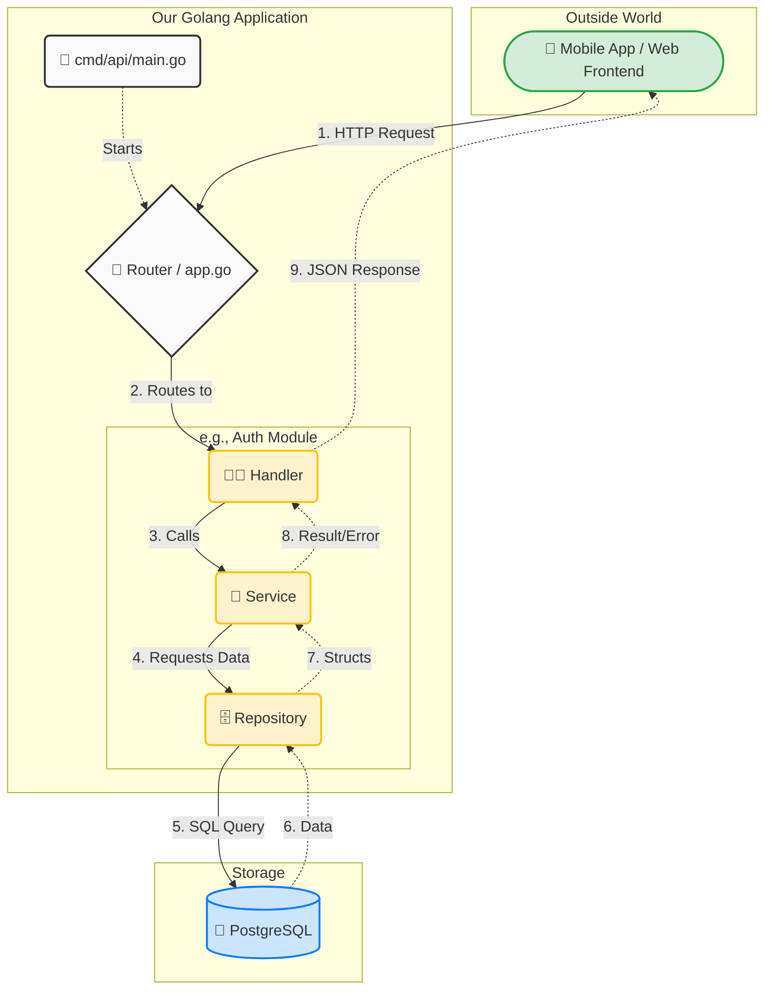
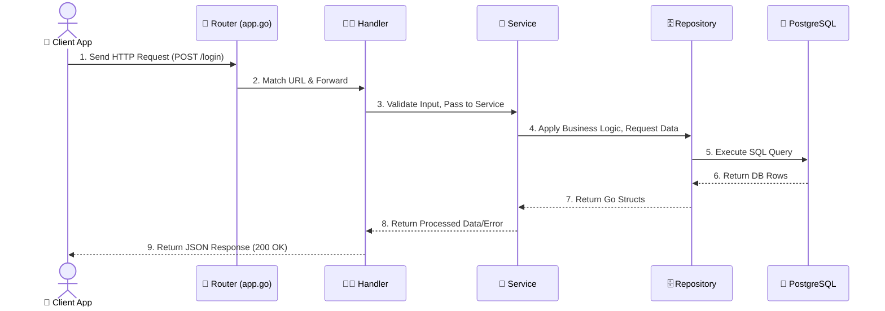

# Application Flow Visualization

This document visually explains how a request travels through our backend system. It is designed to help you easily trace code when you are debugging or adding a new feature.

## The Architecture Flow (High Level)

Here is how the different pieces of our application connect together. Notice how the request moves from the outside world inwards towards the database, and then flows back out.

---

## Detailed Sequence (The "Login" Example)

If you want to see exactly what happens over time, here is the sequence of events:

---

## Step-by-Step Breakdown

Let's walk through the `POST /login` example step by step to see which files are involved.

### Step 1: The Request Arrives 🚪
**File Involved:** `cmd/api/main.go` and `internal/app/app.go`
- The Frontend sends a JSON payload containing an email and password to `https://yourapi.com/api/login`.
- The server receives it in `app.go`. The router looks at the URL `/api/login` and says: *"Aha! This belongs to the Auth Handler."*

### Step 2: The Handler Checks the Inputs 🧑‍🍳
**File Involved:** `internal/modules/auth/handler.go`
- The request reaches the `Login` function inside the Handler.
- **Job:** Check if the email is a real email and if the password is not empty.
- **Next:** If everything is valid, it calls the Service layer: `h.service.Login(email, password)`.

### Step 3: The Service Thinks About It 🧠
**File Involved:** `internal/modules/auth/service.go`
- The request reaches the `Login` function inside the Service.
- **Job:** This is the brain! It needs to verify the user. But to verify the user, it needs the user's data from the database. So, it asks the Repository: `s.repo.GetUserByEmail(email)`.

### Step 4: The Repository Talks to the Database 🗄️
**File Involved:** `internal/modules/auth/repository.go`
- The request reaches `GetUserByEmail` in the Repository.
- **Job:** The Repository writes raw SQL: `SELECT * FROM users WHERE email = $1`. It runs this on PostgreSQL.
- **Next:** It gets the user data back from the database and returns it to the Service.

### Step 5: The Service Makes a Decision 🧠
**File Involved:** `internal/modules/auth/service.go`
- The Service receives the user data from the Repository.
- **Job:** It compares the password from the Frontend with the hashed password from the database.
  - If they match, the Service generates a JWT Token and returns it to the Handler.
  - If they don't match, it returns a "Wrong Password" error to the Handler.

### Step 6: The Handler Responds to the User 🧑‍🍳
**File Involved:** `internal/modules/auth/handler.go`
- The Handler receives the final answer from the Service.
- **Job:** It formats the answer into a nice JSON structure using the `respond` package and sends it back to the Frontend as an HTTP Response (e.g., Status 200 Success or Status 401 Unauthorized).

---

## 🔑 Key Rule to Remember: The "One Way" Street

To keep our code clean and prevent messy bugs, we enforce strict rules about who can talk to whom:

- ❌ **Handlers** CANNOT talk directly to **Repositories**.
- ❌ **Services** CANNOT talk directly to the **Database**.
- ✅ **Handlers** ONLY talk to **Services**.
- ✅ **Services** ONLY talk to **Repositories**.
- ✅ **Repositories** ONLY talk to the **Database**.

If you follow this "One Way" street, your code will always be clean, easy to test, and easy to read!
