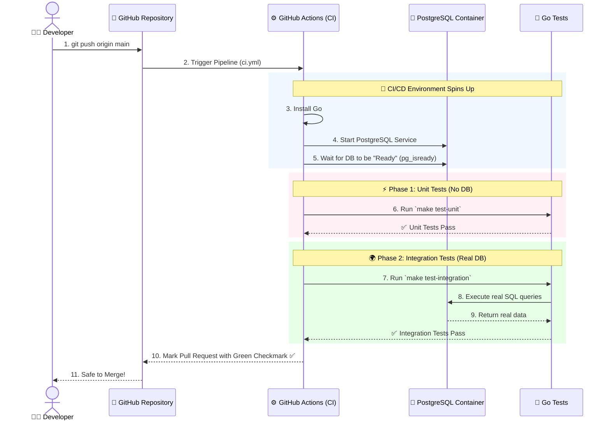
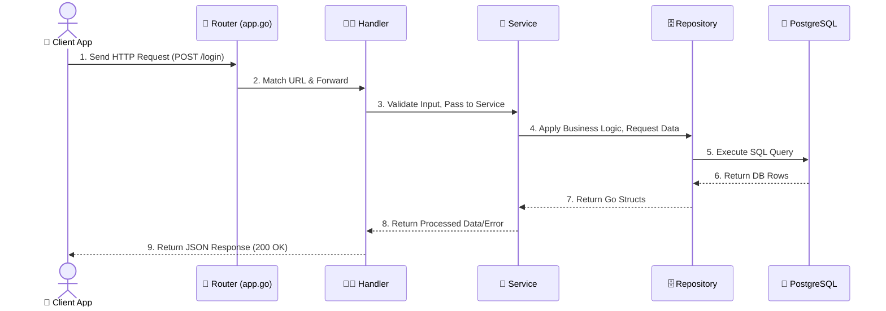

# Application Flow Visualization

This document visually explains how a request travels through our backend system, and how our automated testing (CI/CD) guarantees everything works.

## 1. The Architecture Flow (High Level)

Here is how the different pieces of our application connect together. Notice how the request moves from the outside world inwards towards the database, and then flows back out.

---

## 2. GitHub CI/CD Pipeline (Testing Flow)

Every time you `git push` code, a robot tests it. Here is what happens in the background.

---

## 3. Detailed Sequence (The "Login" Example)

If you want to see exactly what happens over time when a user logs in, here is the sequence of events:

---

## 🔑 Key Rule to Remember: The "One Way" Street

To keep our code clean and prevent messy bugs, we enforce strict rules about who can talk to whom:

- ❌ **Handlers** CANNOT talk directly to **Repositories**.
- ❌ **Services** CANNOT talk directly to the **Database**.
- ✅ **Handlers** ONLY talk to **Services**.
- ✅ **Services** ONLY talk to **Repositories**.
- ✅ **Repositories** ONLY talk to the **Database**.

If you follow this "One Way" street, your code will always be clean, easy to test, and easy to read!
